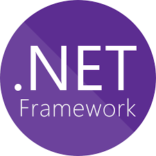

# al salam alaikum | السلام عليكم  
#### I am Software Engineering Student at Cairo University, my name is Yousef Alwaer

 

 

# About me

-  Computer Engineering Student <a href="http://eng.cu.edu.eg/ar/">@Faculty of Engineering Cairo University</a>
- Devops Trainee <a href="https://mcit.gov.eg/en/Human_Capacity/ITI/ITI_Tech_Leaps">@iti</a>
- Former Software Engineering Intern <a href="https://safecotech.com/">@Safcotech</a>
- Former HPC Adminstration Intern <a href="https://mcit.gov.eg/en/Applied_innovation_Center">@AIC</a>
- Former Open Source contributor with<a href="https://gssoc.girlscript.tech/">@Gssoc</a>
- Graduated From Udacity Cloud Developer<a href="http://udacity.com/">@Udacity</a>
- Huawei Cloud Computing Association<a href="https://e.huawei.com/en/talent/#/personal/myinfo">@Huawei</a>
- 🔭 I’m learning about Devops, Cloud, Virtualization, software Engineering, Problem Solving
- 🌱 DevOps enthusiast
- 💬 Ask me about anything and I will be happy to help 

  
# You Can Contact me at
        

  
# my Skills

[]
[]
[]
[]
[]
[]
[]
[]
[]
[] 
[]
[]
[]

[]
[]
[]
[]
[] 
[] 
[]
[]
[]
[]
[]
[] 

  

<h2 align="center">You Can have a Look to my Cv from Here :   </h2>
<h2 align="center">You Can have a Look to my Certifications from Here :   </h2>

 
  Visitor count 
  

